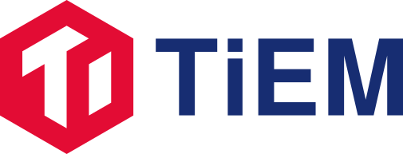

<p style="text-align: center;">
  
</p>

# TiEM UI

[](./LICENSE)

TiEM UI is a general purpose, web-based UI for [TiDB Enterprise Manger](https://github.com/pingcap-inc/tiem).

It allows users to view and manage TiDB clusters through the web-based UI.

Some of the features the TiEM UI supports:

- Cluster creation, deletion, scaling-out, cloning, upgrading etc...
- Realtime monitoring and alerting of cluster status
- Scheduled automatic and manual backups for cluster data
- Cluster data import and export
- Replicating change data to various downstreams
- Cluster parameters management

## Getting Started

First you need to ensure that there is a local or remote TiEM server available to provide API services.

### Prerequisites

The followings are required for developing TiEM UI:

- [Git](https://git-scm.com/downloads)
- [Go](https://golang.org/)
- [Node.js v16+](https://nodejs.org/)
- [Yarn v1](https://classic.yarnpkg.com/en/docs/install)

### Getting the Sources

```bash
# Clone our GitHub repository:
git clone https://github.com/pingcap-inc/tiem-ui

# Go to the tiem-ui directory:
cd tiem-ui
```

### Installing dependencies

```bash
# Install project dependencies (package.json)
yarn install

# Bootstrap tools
yarn bootstrap
```

### Generate Modules

Next, generate remote api files and error message translation files

```bash
yarn generate
```

### Build and run

If you have a local TiEM server, you can just run

```bash
yarn dev
```

That's it! You can access TiEM UI through http://127.0.0.1:3000.

Or if your TiEM server is a remote server, you need to do the following steps before running the command above:

1. Create a `.env.local` file in the root directory of the project
2. Paste the following contents into the `.env.local` file

```ini
# Replace {tiem-address} with the real
# ip address of your remote TiEM server
VITE_MONITOR_URL="http://{tiem-address}:4000/d/em000001/tiem-server?orgId=1&refresh=10s&kiosk=tv"
VITE_LOG_URL="http://{tiem-address}:5601/app/discover"
VITE_ALERT_URL="http://{tiem-address}:4131"
VITE_TRACER_URL="http://{tiem-address}:16686"
VITE_PROXY_API_TARGET="http://{tiem-address}:4100"
VITE_PROXY_FS_TARGET="http://{tiem-address}:4102"
```

## Browser support

TiEM UI has been tested on modern evergreen browsers.

It generally supports:

- Google Chrome 79+ (Windows, macOS, Linux)
- Mozilla Firefox 72+ (Windows, macOS, Linux)
- Apple Safari 14+ (macOS)
- Microsoft Edge 79+ (Windows)

## Need help?

Please use [Github Discussions](https://github.com/pingcap-inc/tiem-ui/discussions) for help requests and how-to questions.

Please open GitHub issues for bugs only, not general help requests. You can search previous issues before creating a new issue.

## Interested in contributing?

Read through our [contributing guidelines](./CONTRIBUTING.md) to learn about our submission process and more.

If you want to contribute through code, read the [development guide](./doc/development.md) to learn about our development process, and how to build your changes to TiEM UI.

## License

Copyright 2022 PingCAP, Inc. All rights reserved.

Licensed under the [Apache 2.0 License](./LICENSE).
